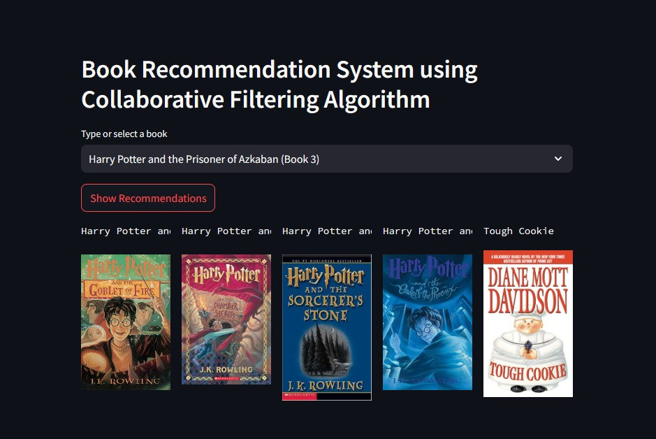

# Book Recommendation System

This project is a Book Recommendation System built using `collaborative filtering` algorithm. It's implemented as a web application using `Streamlit`, allowing users to interactively receive book recommendations based on their selection.

<p align="center">
  
  <br>
  <em>Book Recommendation System Web App User Interface</em>
</p>

**Dataset**: https://www.kaggle.com/datasets/ra4u12/bookrecommendation


## Application Access
- This web application is deployed on `Render`. Since it is hosted on a free instance, app startup can take up to 50 seconds or more due to cold start.
```
https://book-recommendation-system-5e20.onrender.com/
```

## How It Works

1. The user selects a book from a dropdown menu containing a vast array of book titles.
2. Upon clicking "Show Recommendations", the system uses a pre-trained model to find similar books.
3. The application displays 5 book recommendations, showing both the title and cover image for each recommended book.

## Technical Details

- The recommendation model is built using `SKLearn`'s k-Nearest Neighbors clustering algorithm via Jupyter Notebook.
- Book data, including titles and cover image URLs, is stored in preprocessed dataframes.
- The model and necessary data are loaded from pickle files for efficient performance.


